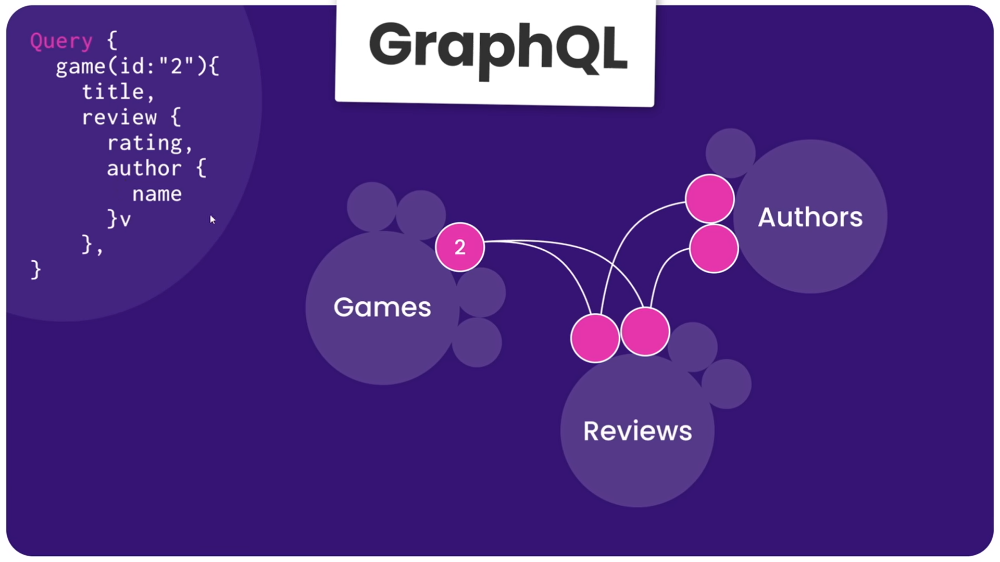

# Queries in GraphQL


Queries from frontend : 

1. Query to get reviews with content like rating, content and id of the review.
    ```
    query ReviewQuery {
        reviews{
            rating,
            content,
            id
        }
    }
    ```
2. Query to get reviews
   ```
    query ReviewQuery {
        reviews{

        }
    }
    ```

3. Query to get reviews with id
   ```
    query ReviewQuery {
        reviews{
            id
        }
    }
    ```

## Explanation

1. Graph schema for data 
2. Link between tables 
3. Query with Params 
4. How Graphs are connected 

So we have to design the graph in such a manner that we can run queries and return the nested response asked by the frontend/client.
